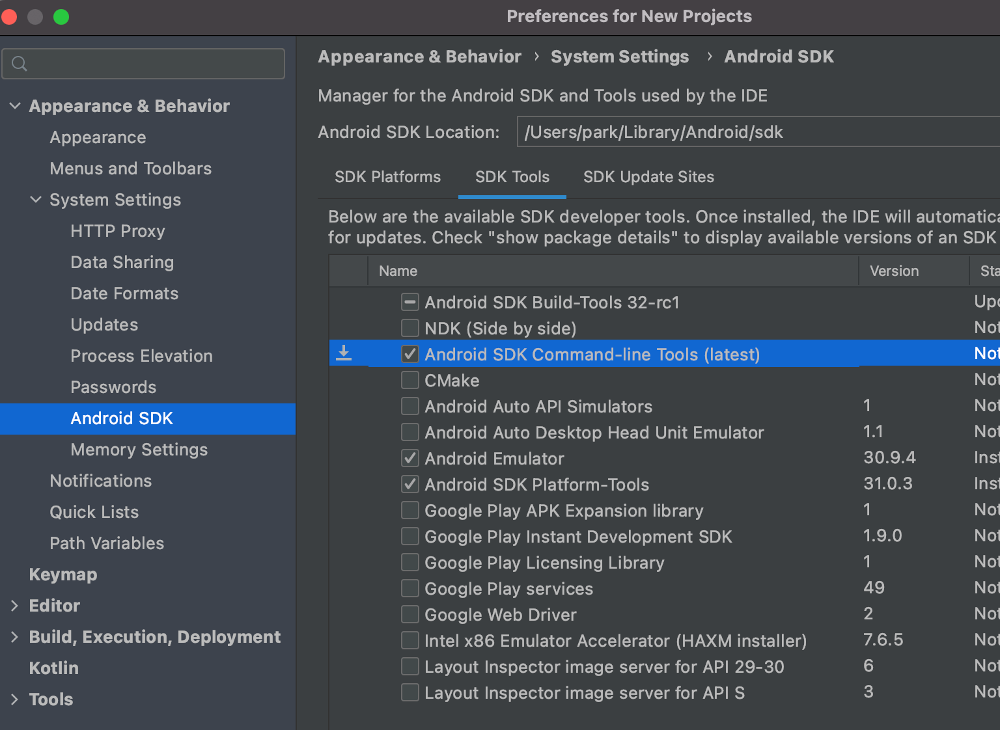

# SSAFY 공통 프로젝트 DOGDACK - 리팩토링

## Setting

1. Flutter 설치
   - https://flutter.dev/docs/development/tools/sdk/releases?tab=windows
   - 다운로드 폴더는 경로에 한글이 없는 C드라이브 폴더
     - C:\flutter
2. android studio 설치
3. android studio plugin 설치
   - flutter
   - dart
4. sdk manager
   - sdk tools 의 Android SDK Command-line tools 부분 체크하고 적용
   - 
5. 환경변수 등록
   - 시스템 환경 변수 편집 -> 환경변수 -> User에 대한 사용자 변수 편집 -> flutter\bin 경로 등록
6. 환경 테스트
   - powershell 실행
   - flutter doctor 입력
   - 발생한 각 에러 해결

## Developing

1. 기존 S08P12A503 폴더의 DogDack 프로젝트를 분석 후 리팩토링한다.
