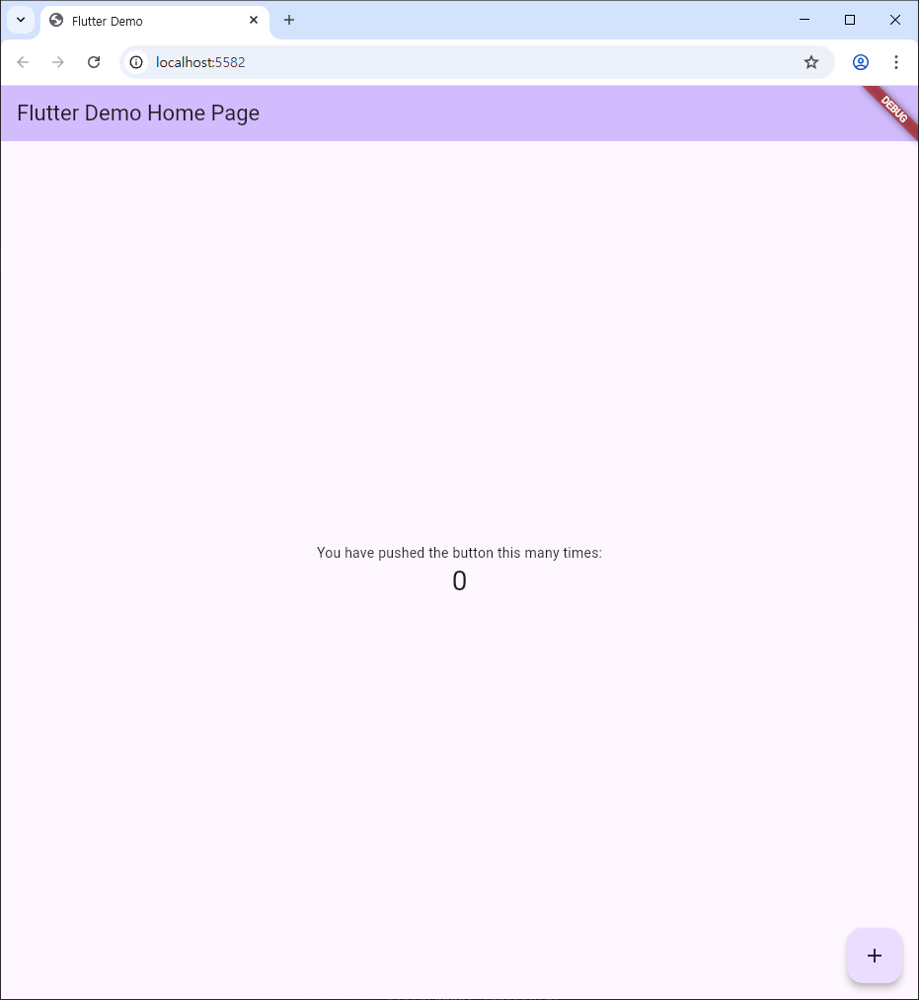

# SSAFY 공통 프로젝트 DOGDACK - 리팩토링

## Setting

1. Flutter 설치
   - https://flutter.dev/docs/development/tools/sdk/releases?tab=windows
   - 다운로드 폴더는 경로에 한글이 없는 C드라이브 폴더
     - C:\flutter
2. android studio 설치
3. android studio plugin 설치
   - flutter
   - dart
4. sdk manager
   - sdk tools 의 Android SDK Command-line tools 부분 체크하고 적용
   - 
5. 환경변수 등록
   - 시스템 환경 변수 편집 -> 환경변수 -> User에 대한 사용자 변수 편집 -> flutter\bin 경로 등록
6. 환경 테스트
   - powershell 실행
   - flutter doctor 입력
   - 발생한 각 에러 해결
7. 동작 확인
   - 상단의 휴대폰 모양에서 chrome을 선택 후 초록색 재생 버튼을 눌러 크롬 창에 화면이 뜨는지 확인
   - 다음 화면이 뜨면 성공
   - 
8. Firebase 연동
   - Web에서 Firebase 콘솔에 접속
   - 프로젝트 생성
   - android studio terminal에 명령어($) 입력
     - npm(node.js) 버전 업데이트
     - 시스템 환경 변수 -> 시스템 변수 -> path 에 nodejs 파일의 정확한 경로 추가 (C:\Program Files\nodejs)
     - $ npm install -g firebase-tools
     - $ firebase login
     - $ dart pub global activate flutterfire_cli
       -> 경고 메세지 뜨면 환경변수에 경로 추가(ex : C:\Users\User\AppData\Local\Pub\Cache\bin)
     - $ flutter pub add firebase_core
     - androidstudio(or cmd 등) 재시작
     - $ flutterfire configure
       - 위에서 생성한 firebase 프로젝트 선택
       - main.dart 파일에 있는 main 함수를 다음과 같이 수정
       - 
         

## About Flutter
1. 플러터 프로젝트를 실행하면 가장 먼저 main.dart가 실행되며, main 함수 내부의 runApp 함수를 실행시켜 플러터 프로젝트를 시작한다.

## Developing
2025-05-12
1. 기본 환경 세팅
2. 리드미 설정 가이드 작성

2025-05-13
1. 플러터 동작 확인
